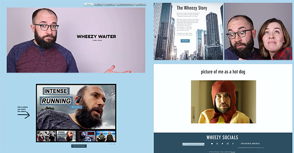
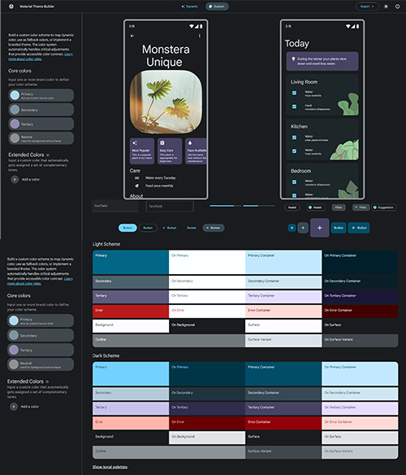
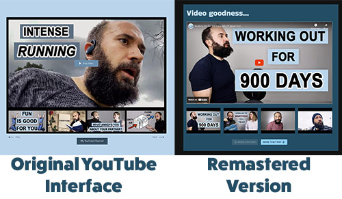

# Demo Creator Page for Wheezy Waiter

## A proof of concept for a content creator website

___

This project is meant to push me to continue learning react while also pushing me to learn another framework, namely [Material UI](https://mui.com/).

I approached my friend Craig about possibly making a site for him in order to keep up my skills post bootcamp and he was all for it. He didn't have a lot of time to consult on things with his schedule so I essentially recreated his current Wix website.

Let's see how it all turned out.

[You can see it live here to take a look. ](https://markgatx.github.io/wheezywaiter/)

___

## Table of Contents
- [Project Description](#Description)
- [Process](#Process)
- [How to Use](#How-to-use)
- [Technologies](#Technologies)
- [Lessons Learned](#Lessons-Learned)
- [Possible Future Changes](#Possible-Future-Changes)

___

## Process

To begin with I went to the original Wheezy Waiter website to see what it was like. I also paid attention to his YouTube videos and social feeds to get a feel for what he's working on and what I should focus on the most.

I've been looking in to the Material Design concepts and I wanted to try and use some of those concepts in a rebuild project. To start with I needed to find a framework that would work well. In reality I could use any framework and modify the content to follow along with Material Design concepts, but I wanted a framework that had some of that already in place.

I narrowed it down to two contenders: Materialize and Material UI. I finally settled on Material UI since it seems to not only embrace the React framework, but turn it up to 11. So I started in on the documentation to get a grasp on using it.

I also turned to the design side of things. Without specific guidance on styles and content from the creator, I felt it best to stick with the overall look and feel, but just update the overall site. So while I tried to update some of the look and feel of the site, I kept an overall minimalist vibe.

The light blue color on the site is also used on his YouTube videos for thumbnails so that was going to be my main color. While Material UI does have the ability to automatically render colors that will work with custom colors that you define, it wasn't quite the same as what I was reading on the official Material Design sites. So I decided to create a basic custom theme.

Material Design has a great tool for their newest version of Material Design that helps show color themes based on their criteria. I put in the basic blue for Craig's site and used the generated colors to define custom values in a MUI custom theme.

I also decided that I wanted this be a one page site as opposed to multiple pages with a header menu. (That decision would later change, but it at least informed the initial design decisions.) I then looked at each page and took the most important information from each of them to render them into components. 

The most challenging part was the YouTube interface. While there are surely plugins available on npm that could do that job, I wanted to try and build my own version. 

Since the queries to YouTube would be very simple I decided to stick with using Axios to handle the API endpoints. I was able to quickly get JSON data and build the YouTube interface. With the JSON data in hand it was fairly straightforward to build the YouTube layout, although it took some experimenting with MUI to get things to flex as intended. 

After the page was essentially finished, I felt it was still missing important things to really function well. I decided I needed to add an additional page and a header menu.

The additional page would be a place to feature other projects that Craig has been involved in. This would turn the page into not only a home on the internet but a portfolio of some of his work.

Building the second page wasn't too time consuming since the YouTube sections were essentially copied from the main page and the podcast link has their own iframe embed codes.

Once that page was done, I felt it needed a dark mode. I took the simple way and created two custom themes and a toggle that would render one theme or the other based on the user selection.

___

## How to use

At the top header you'll have choices in the menu at the right: Home, Projects, and mode.

THe Home selection focuses on YouTube videos and Craig's social media feeds. It also has a home to thank his Patreon supporters. To watch videos, simply click on the large frame and the video will play. If you want to watch a different video, click on one of the thumbnails underneath. The title of the video will popup as a tooltop once you mouse over it. If you want to see different videos, use the buttons below to navigate to the next four or the previous four videos in the playlist.

The Projects page consists of two more YouTube sections that function just like the main page in terms of watch and navigation. There is also an embedded podcast that you can listen to by pressing the play button on the podcast itself.

The mode button will either be a sun or a moon icon depending on whether you're in dark mode or light mode. Clicking on one will toggle the page and the icon either dark or light mode.

___

## Technologies

    - React
    - MUI
    - Node.js
    - Javascript
    - Axios
    - CSS3
    - HTML5
    - YouTube API

___

## Lessons Learned

- I learned a lot about Material UI but this project still barely scratches the surface of what could be done. As a framework, it feels like they've taken React and dialed it up to 11. One of the harder things to get used to was that virtually EVERY part of the page needed to be a component, even text. There was also a lot of inline styling done via the MUI `sx` prop. It may be possible to do that via custom classes but I tried to avoid custom CSS as much as possible for this project and to really embrace the interface.

- Sometimes simple is perfect. Using Axios to make the YouTube API work was simple and saved a lot of time in developing the YouTube interface for the site. It took one line of code to get the information from YouTube.

- On the same note, the dark mode feature was fairly simple to implement, but I think MUI has a native way to handle things that would be less code. I had trouble making it work as intended and couldn't find good documentation on fixing the problem. So instead of pounding my head against the wall trying to force it to work, I did something with a few more lines of code but just as effective. It may need some tweaks to make sure it's as fast as it should be, but dark mode works.

- Craig's original site has a great fixed image of him and his wife that I tried to recreate. Unfortunately I had a lot of trouble making it work like it does on the Wix site. Digging around in the console, it looks like Wix has a ton of media queries that change the size of the image to make it work as intended. While I could replicate that with enough time, I felt it was a lower priority. So I added an eagle to the page instead. (One of Craig's early bits in his videos was of him repeatedly punching eagles.)

 ___

## Possible Future Changes

- Add more projects
- Add blog and logged in functionality
- Reformat the MUI imports to be more efficient
- Reformat dark mode to take advantage of MUI's native implementation
- Add transition effects to YouTube updates

___

## Credits
Thanks to Craig for letting me use his site as a test-bed and guinea pig. 

___

## License

MIT License

Copyright (c) 2022 Mark Gardner

Permission is hereby granted, free of charge, to any person obtaining a copy
of this software and associated documentation files (the "Software"), to deal
in the Software without restriction, including without limitation the rights
to use, copy, modify, merge, publish, distribute, sublicense, and/or sell
copies of the Software, and to permit persons to whom the Software is
furnished to do so, subject to the following conditions:

The above copyright notice and this permission notice shall be included in all
copies or substantial portions of the Software.

THE SOFTWARE IS PROVIDED "AS IS", WITHOUT WARRANTY OF ANY KIND, EXPRESS OR
IMPLIED, INCLUDING BUT NOT LIMITED TO THE WARRANTIES OF MERCHANTABILITY,
FITNESS FOR A PARTICULAR PURPOSE AND NONINFRINGEMENT. IN NO EVENT SHALL THE
AUTHORS OR COPYRIGHT HOLDERS BE LIABLE FOR ANY CLAIM, DAMAGES OR OTHER
LIABILITY, WHETHER IN AN ACTION OF CONTRACT, TORT OR OTHERWISE, ARISING FROM,
OUT OF OR IN CONNECTION WITH THE SOFTWARE OR THE USE OR OTHER DEALINGS IN THE
SOFTWARE.
